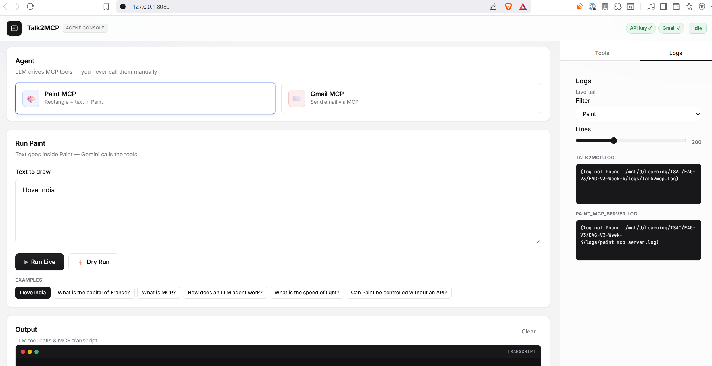
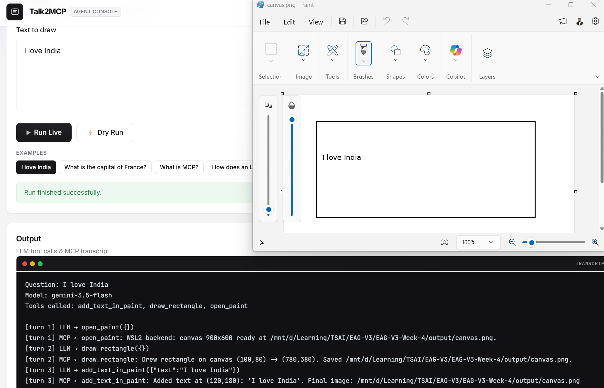
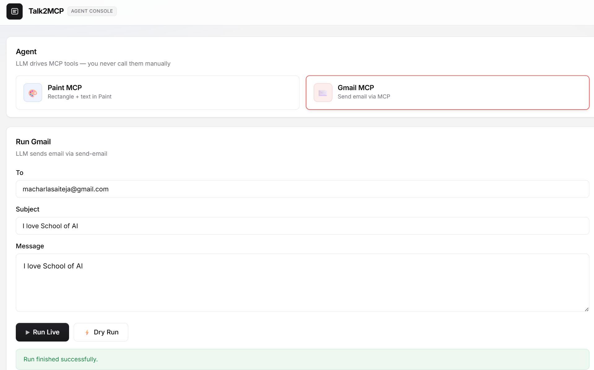
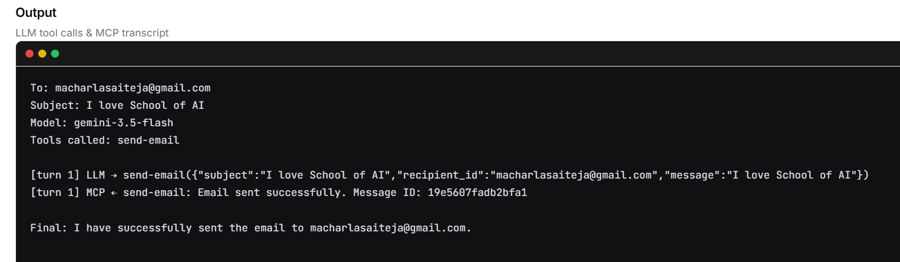
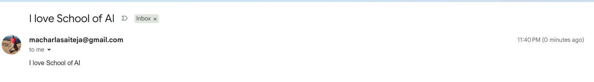

# Talk2MCP

**LLM agents that control apps without APIs through custom MCP servers.**

- **Paint MCP** — Gemini opens Paint, draws a rectangle, and writes your question inside it.
- **Gmail MCP** — Gemini sends email via an external Gmail MCP server.

Paint has no API and no MCP server. This project builds one, then lets **Gemini 3.5 Flash** decide when to call tools. The same MCP pattern applies to Gmail.

> **Core rule:** You provide input (a question or email). The **agent** (not you) must call MCP tools. Your job is to prompt and wire I/O correctly so the LLM actually does it.

---

## YouTube demo

[](https://www.youtube.com/watch?v=Lf0_HDAvU0A)

**Watch the full walkthrough:** [https://www.youtube.com/watch?v=Lf0_HDAvU0A](https://www.youtube.com/watch?v=Lf0_HDAvU0A)

Paint MCP (rectangle + text in MS Paint), Gmail MCP (LLM sends email via `send-email`), web UI, and live MCP logs — end to end.

---

## Screenshots

<table align="center" width="100%">
<tr>
<td width="50%" valign="top" align="center">



**Agent Console**

Dual-agent dashboard — switch Paint or Gmail, run live/dry, example chips, status pills (`API key`, `Gmail`, `Idle`), and live log tail in the sidebar.

</td>
<td width="50%" valign="top" align="center">



**Paint MCP — live demo**

Question `"I love India"` → Gemini calls `open_paint` → `draw_rectangle` → `add_text_in_paint`. MS Paint shows the rectangle + text; transcript proves the LLM drove all three tools.

</td>
</tr>
<tr>
<td width="50%" valign="top" align="center">



**Gmail MCP — compose**

Select **Gmail MCP**, fill To / Subject / Message, then **Run Live** or **Dry Run**. The LLM calls `send-email` via MCP — you never hit the Gmail API yourself.

</td>
<td width="50%" valign="top" align="center">



**Gmail MCP — transcript**

Output panel shows `send-email` tool call, MCP response (`Message ID: …`), and final LLM confirmation — proof for your demo video.

</td>
</tr>
<tr>
<td colspan="2" valign="top" align="center">



**Gmail MCP — inbox proof**

Email delivered to the recipient inbox. Pair with `logs/talk2gmail.log` in your submission video.

</td>
</tr>
</table>

---

## What it does

1. You provide a question, e.g. `"What is the capital of France?"`
2. The **agent** (`talk2mcp.py`) sends that to Gemini with MCP tool definitions
3. Gemini chooses tools one at a time:
   - `open_paint` → launch / prepare canvas
   - `draw_rectangle` → draw a box
   - `add_text_in_paint(text="...")` → write your question inside
4. Each tool call goes over MCP stdio to `paint_mcp_server.py`, which drives Paint
5. Logs record every `LLM chose tool:` line — proof the model did it, not you

**Output:** A real Paint window (or PNG opened in Paint on WSL) with a rectangle and your text.

---

## How it works

```
┌─────────────────┐     question      ┌──────────────────┐
│  You / Web UI   │ ───────────────►  │   talk2mcp.py    │
│  or CLI         │                   │  (Gemini agent)  │
└─────────────────┘                   └────────┬─────────┘
                                               │
                                    Gemini decides tools
                                               │
                                               ▼
                                    ┌──────────────────┐
                                    │  MCP (stdio)     │
                                    │ paint_mcp_server │
                                    └────────┬─────────┘
                                             │
                         ┌───────────────────┼───────────────────┐
                         ▼                   ▼                   ▼
                   open_paint         draw_rectangle    add_text_in_paint
                         │                   │                   │
                         └───────────────────┴───────────────────┘
                                             │
                         ┌───────────────────┴───────────────────┐
                         ▼                                       ▼
              WSL2: Pillow → output/canvas.png          Windows native:
              → cmd.exe opens Paint                       pywinauto clicks
```

### Agent safeguards (why the LLM actually calls tools)

| Mechanism | Purpose |
| --- | --- |
| **System + user prompts** | Tell Gemini the exact 3-tool sequence and to write the question, not answer it |
| **`mode=ANY`** | Forces tool use until all 3 tools have been called |
| **Order validation** | Rejects wrong order, duplicates, or extra calls after completion |
| **Nudge messages** | If Gemini replies in plain text too early, agent pushes it back to tools |
| **Text fallback** | If `add_text_in_paint` omits `text`, agent injects your question |
| **Early exit** | After all 3 Paint tools run, agent finishes without an extra Gemini turn (avoids hangs) |

---

## Project files

| File | Role |
| --- | --- |
| `talk2mcp.py` | Gemini Paint agent + MCP client loop |
| `paint_mcp_server.py` | Custom MCP server: WSL/Windows backends, 3 Paint tools |
| `talk2gmail.py` | Gmail agent + OAuth config and setup (all in one file) |
| `app.py` | FastAPI web UI, agents API, live log viewer |
| `templates/index.html` | Agent console UI |
| `static/js/app.js` | Polling, examples, running-state, logs |
| `.env` | API key, backend, canvas coords, Gmail OAuth paths |
| `.google/client_creds.json` | Desktop OAuth client JSON from GCP |
| `.google/app_tokens.json` | OAuth token (created by setup — do not commit) |
| `output/canvas.png` | Final drawing (WSL/Linux path) |
| `logs/talk2mcp.log` | Paint agent log — scroll in demo video |
| `logs/paint_mcp_server.log` | Paint automation server log |
| `logs/talk2gmail.log` | Gmail agent log |
| `tests/test_paint.py` | Paint agent + MCP server tests |
| `tests/test_gmail.py` | Gmail agent + OAuth tests |
| `tests/test_app.py` | FastAPI / web API tests |

---

## Quick start

### 1. Install

```bash
cd /mnt/d/Learning/TSAI/EAG-V3/EAG-V3-Week-4
python3 -m venv .venv
source .venv/bin/activate          # Windows: .venv\Scripts\activate
pip install -r requirements.txt
```

On WSL/Linux, Windows-only packages (`pywin32`, `pywinauto`) are skipped automatically.

### 2. Configure

Edit `.env` and set your Gemini key:

```env
GEMINI_API_KEY=your_real_key_here
GEMINI_MODEL=gemini-3.5-flash
DRAW_BACKEND=auto
```

### 3. Verify backend

```bash
python paint_mcp_server.py --info
```

Expected on WSL2:

```
Detected backend: wsl
WSL: True | os.name: posix
Canvas: 900x600
```

### 4. Run the agent (assignment demo)

```bash
python talk2mcp.py "What is the capital of France?"
```

**Do not** run paint tools yourself — only the LLM should.

### 5. Confirm logs

```bash
grep "LLM chose tool" logs/talk2mcp.log
```

You should see:

```
LLM chose tool: open_paint({})
LLM chose tool: draw_rectangle({})
LLM chose tool: add_text_in_paint({"text": "What is the capital of France?"})
```

---

## Web UI

```bash
uvicorn app:app --reload --port 8080
```

Open **[http://localhost:8080](http://localhost:8080)**

| Feature | Details |
| --- | --- |
| **Agent cards** | Switch **Paint MCP** or **Gmail MCP** |
| **Run Live** | Real Gemini + MCP (needs valid API key; Gmail needs OAuth token) |
| **Dry Run** | Simulated tool calls — no API, no Paint/Gmail |
| **Example chips** | One-click fill for the Paint question field |
| **Output** | Live MCP transcript (tool calls + results) |
| **History** | Session run log (agent, mode, success) |
| **Tools tab** | Required MCP tool order for the selected agent |
| **Logs tab** | Live tail of agent + server logs while running |
| **Status bar** | `API key`, `Gmail`, `Idle` / `Running` |

Hard-refresh after updates: `Ctrl+Shift+R`.

---

## Examples

### CLI — live run

```bash
python talk2mcp.py "What is MCP?"
```

Gemini calls all 3 tools → Paint shows a rectangle with `What is MCP?` inside.

### CLI — dry run (no API, no Paint)

```bash
python talk2mcp.py --dry-run "Test question"
```

Simulates the 3 tool calls locally. Logs still show the tool sequence.

### CLI — interactive

```bash
python talk2mcp.py
# prompts: Question to draw inside Paint:
```

---

## Backends

The server picks a backend automatically (`DRAW_BACKEND=auto`).

| Backend | When used | How Paint is controlled |
| --- | --- | --- |
| **`wsl`** | WSL2 (recommended) | Pillow draws on `output/canvas.png`, opens in Windows Paint via `cmd.exe` |
| **`windows`** | Native Windows Python | `pywin32` + `pywinauto` + `pyautogui` — live mouse clicks |
| **`linux`** | Pure Linux (no Windows) | Pillow canvas + optional `xdg-open` viewer |

Force a backend in `.env`:

```env
DRAW_BACKEND=wsl       # WSL2
DRAW_BACKEND=windows   # native Windows only
DRAW_BACKEND=linux     # no Paint
```

Paint options (WSL):

```env
PAINT_AUTO_CLOSE=true    # auto-close Paint after draw
PAINT_CLOSE_DELAY=6      # seconds before close
```

---

## Configuration (`.env`)

### Required

```env
GEMINI_API_KEY=your_key
GEMINI_MODEL=gemini-3.5-flash
```

### WSL canvas (Pillow)

```env
WSL_OPEN_IN_PAINT=true
CANVAS_WIDTH=900
CANVAS_HEIGHT=600
PAINT_RECT_X1=100
PAINT_RECT_Y1=80
PAINT_RECT_X2=780
PAINT_RECT_Y2=380
PAINT_TEXT_X=120
PAINT_TEXT_Y=180
```

### Dual monitor (Windows native backend only)

```env
PAINT_MONITOR_INDEX=1    # 0 = primary, 1 = second monitor
```

> On WSL, `PAINT_MONITOR_INDEX` does not move the Paint window — use native Windows Python with `DRAW_BACKEND=windows` for second-monitor control.

---

## Assignment checklist

| Requirement | How to show it |
| --- | --- |
| Custom MCP server for Paint | `paint_mcp_server.py` exposes exactly 3 tools |
| Agent calls tools (not manual) | `talk2mcp.py` only uses MCP `call_tool`; logs show `LLM chose tool:` |
| Question written in Paint box | Pass any question; text appears via `add_text_in_paint` |
| YouTube video | Show Paint with rectangle + text, then scroll `logs/talk2mcp.log` |
| GitHub link | Push repo; share link to `talk2mcp.py` |

---

## Gmail MCP

Same idea as Paint — **the LLM sends email via MCP**, you never call Gmail APIs yourself.

**References:**

- [Create a Gmail Agent with MCP (Medium)](https://medium.com/@jason.summer/create-a-gmail-agent-with-model-context-protocol-mcp-061059c07777)
- [jasonsum/gmail-mcp-server (GitHub)](https://github.com/jasonsum/gmail-mcp-server)

### 1. Google Cloud setup (2025+ Auth platform)

| Step | URL |
| --- | --- |
| Enable Gmail API | [console.cloud.google.com/apis/library/gmail.googleapis.com](https://console.cloud.google.com/apis/library/gmail.googleapis.com) |
| Branding | [console.cloud.google.com/auth/branding](https://console.cloud.google.com/auth/branding) |
| Audience (External + test users) | [console.cloud.google.com/auth/audience](https://console.cloud.google.com/auth/audience) |
| Data Access (`gmail.modify`) | [console.cloud.google.com/auth/scopes](https://console.cloud.google.com/auth/scopes) |
| Clients → Desktop app | [console.cloud.google.com/auth/clients](https://console.cloud.google.com/auth/clients) |

1. Create or select a GCP project
2. Enable Gmail API
3. **Audience** — External, Testing, add your `@gmail.com` as **Test user**
4. **Data Access** — add `https://www.googleapis.com/auth/gmail.modify`
5. **Clients** — **Desktop app** (not Web) → download JSON → `.google/client_creds.json`
6. Add redirect URIs if shown: `http://localhost`, `http://localhost:8090`

### 2. Clone Gmail MCP server

```bash
git clone https://github.com/jasonsum/gmail-mcp-server.git
# Requires uv: https://docs.astral.sh/uv/
```

### 3. Configure `.env`

```env
GMAIL_MCP_REPO=/path/to/gmail-mcp-server
GMAIL_MCP_RUNNER=uv
GMAIL_OAUTH_CREDS_FILE=/path/to/.google/client_creds.json
GMAIL_OAUTH_TOKEN_FILE=/path/to/.google/app_tokens.json
GMAIL_OAUTH_SCOPE=https://www.googleapis.com/auth/gmail.modify
GMAIL_OAUTH_PORT=8090
GMAIL_OAUTH_REDIRECT_URI=http://localhost
GMAIL_TEST_USER=your@gmail.com
```

### 4. Create OAuth token (one time)

**Recommended on WSL — no URL paste:**

```bash
python talk2gmail.py --setup-oauth-web
```

Opens `http://localhost:8090/` in Windows Chrome → sign in → Allow → token saves to `.google/app_tokens.json` automatically.

**Other methods:**

```bash
python talk2gmail.py --check-gmail          # status
python talk2gmail.py --setup-oauth          # manual paste after Allow
python talk2gmail.py --oauth-code "URL"     # paste redirect if setup still open
```

Verify:

```bash
python talk2gmail.py --check-gmail
# ready: True, token: ✓
```

### 5. Run the Gmail agent

```bash
# Dry-run
python talk2gmail.py --dry-run --to you@gmail.com --subject "MCP test" --body "Hello from agent"

# Live
python talk2gmail.py --to you@gmail.com --subject "MCP test" --body "Sent by Gemini via MCP"
```

Check logs:

```bash
grep "LLM chose tool" logs/talk2gmail.log
```

### Gmail demo checklist

- Show the email in Gmail inbox (see `Images/5.png`)
- Scroll `logs/talk2gmail.log` or web **Output** showing `send-email` tool call

---

## Tests

```bash
pytest tests/ -v
```

65 tests across `test_paint.py`, `test_gmail.py`, and `test_app.py`.

---

## Troubleshooting

| Problem | What to try |
| --- | --- |
| `Set a valid GEMINI_API_KEY` | Put a real key in `.env` |
| Paint doesn't open from WSL | `WSL_OPEN_IN_PAINT=true`; run `cmd.exe /c echo ok` in WSL |
| Agent stuck on Running | Hard refresh UI; stale runs auto-clear after timeout |
| Example chips don't fill | Hard refresh (`Ctrl+Shift+R`); chips disabled only while running |
| LLM skips a tool | Re-run; agent nudges and enforces order |
| Gmail `OAuth token missing` | `python talk2gmail.py --setup-oauth-web` |
| Gmail `invalid_grant` | Code expired — re-run setup; paste within 60s |
| Gmail `Access blocked` | Add email under Audience → Test users |
| OAuth `redirect_uri` error | Use latest `talk2gmail.py`; Desktop client JSON with `"installed"` block |
| Local OAuth state mismatch | Don't reuse old `oauth_auth_url.txt` — use URL from current terminal |

---

## Submission tips

1. **Demo video:** [YouTube walkthrough](https://www.youtube.com/watch?v=Lf0_HDAvU0A)
2. Run one successful **live** Paint demo: `python talk2mcp.py "What is the capital of France?"`
3. Record Paint showing the rectangle and your question text
4. Scroll `logs/talk2mcp.log` (or Web UI **Logs** tab) showing `LLM chose tool:` lines
5. Optional: Gmail live demo + inbox screenshot
6. Push to GitHub and submit the link to **`talk2mcp.py`**

Include `paint_mcp_server.py` in the same repo — the agent starts it automatically at runtime.
